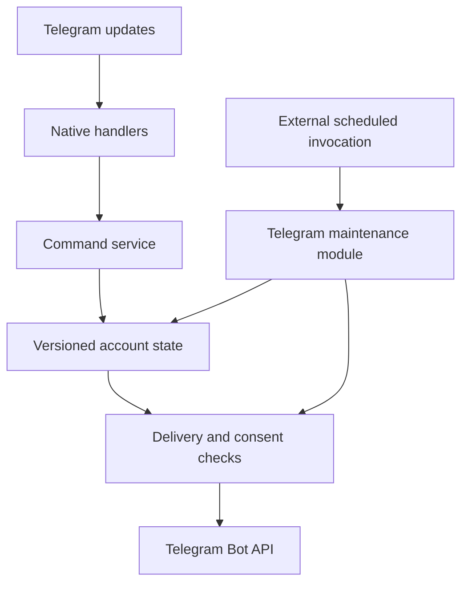

# Native Telegram Serverless architecture

## Goals delivered

1. Run the bot on Telegram's own Serverless platform: no VPS, Cloudflare,
   polling process, handwritten webhook registration, or runtime npm dependencies.
2. Keep tracking records consistent under retries and concurrent button presses.
3. Make partner sharing opt-in, scoped, revocable, and checked before delivery.
4. Preserve English/Farsi and Gregorian/Persian calendars, add correction, undo,
   daily symptoms, export, deletion, and user timezones.
5. Share one transparent historical prediction function across history and reminders.
6. Provide regression tests, a native compatibility probe, and a reversible migration path.

## Components

| Component | Responsibility |
|---|---|
| handlers/message.js, handlers/callback_query.js | Native update entry points; use ctx.update.update_id |
| lib/runtime.js | Dispatch, acknowledge callback queries, drain affected accounts |
| lib/app.js | Validate commands; plan account changes; enforce ownership and consent |
| lib/store.js | Read records and commit with compare-and-swap revision checks |
| lib/dates.js, lib/ui.js, lib/messages.js | Date-only logic, one predictor, calendars and bilingual messages |
| lib/delivery.js | Durable outbox, leases, retries and last-moment access checks |
| lib/maintenance.js | Reminder production, delivery retries, expiry cleanup and tombstone removal |
| schema.js | Two platform-managed tables: accounts and maintenance jobs |

## Why an account aggregate

The published Telegram SDK exposes asynchronous SQLite reads/writes but does not
document a transaction API; foreign keys are explicitly disabled. A D1-style
batch transaction or a sequence of BEGIN/COMMIT calls would assume capabilities
the SDK does not promise.

Each account therefore stores its preferences, period records, symptoms, latest
undo snapshot, confirmation tokens, processed-update ledger, and outbox in one
JSON document. Identity, role, partner recipient, invitation token/expiry, and
revision are scalar columns. Unique constraints enforce one owner per partner
and unique invitation tokens. Schema checks reject self-pairing and grants owned
by a non-primary account.

A command reads revision N, validates and modifies the in-memory account, then
executes one UPDATE ... WHERE revision=N RETURNING revision. That one SQLite
statement atomically commits the state, deduplication key, and pending reply.
If another writer won, the service rereads and retries up to eight times.
Invalid edits never save their partially modified document.

This is an intentional small-bot design. It avoids cross-statement transactions,
but rewrites the user's document on each command/delivery. The current defensive
limit is 1,000,000 JSON characters per account. Monitor size and contention before
expanding beyond a pilot. Do not claim this is a high-volume analytics schema.

## Pairing and authorization

- The primary account owns the only authoritative grant. There is no reciprocal
  partner pointer to become stale after replacement.
- Invitation tokens contain 24 bytes produced by SQLite randomblob and expire
  after ten minutes. They are stored as sensitive bearer values, not logged.
  The published SDK does not advertise Web Crypto; this implementation does not
  silently fall back to Math.random or claim hashed-token storage.
- Joining requires an explicit support-role action, an unexpired invitation, no
  existing connection, and at most five attempts per account per ten minutes.
- Acceptance clears the invitation and creates a new grant identifier in the
  same owner update. An SQL guard verifies the recipient's role and revision.
- Periods, symptoms, and predictions/reminders are independently disabled initially.
- Incoming commands that touch another account persist their exact target and
  grant before execution. Recovery of an old disconnect cannot revoke a new grant.
- Every partner status and notification is rendered only after verifying the
  current owner, recipient role, grant identifier and scope. Revocation removes
  queued scoped messages. Partner details are never sent to group chats.
- Role changes retain history. Incoming links are revoked before a confirmed role
  change; outgoing links are removed in the account update. This cleanup is
  deliberately fail-closed if an invocation fails halfway through.

There is no global transaction spanning two users. Cross-account actions are
recoverable operations with fixed targets, guarded writes and idempotency records.
Authorization always derives from current state rather than completion of both
sides of an operation.

## Delivery semantics

The outbox is committed with each account mutation. A dispatcher leases a message
for two minutes through the same revision mechanism, then rechecks authorization.
Successful sends remove the queued payload. HTTP 429 honors retry_after; transient
failures use bounded exponential retry. HTTP 400/403 or five failed attempts drop
the payload and emit only a numeric error code. Payloads otherwise expire after
one day; requested partner status expires after ten minutes.

Domain mutations are deduplicated within a seven-day retained update ledger.
Old inbound message payloads are rejected outside that window. Telegram message
delivery is **at least once**, not exactly once: an API call can succeed and its
response be lost before the queue is marked delivered. A disconnect cannot recall
a message already delivered or cancel an API request already in flight.

No raw health data, API error descriptions, tokens, or Telegram identifiers are
written to application logs. The maintenance result reports counts only.

## Dates and estimates

Dates are Gregorian ISO date-only strings internally. Intl formats Gregorian or
Persian calendars and IANA user timezones. The date picker advances from actual
calendar-month boundaries; no handwritten Jalali leap-year approximation is used.
Validate hosted Intl support with the native smoke command.

Three period starts are required for a prediction. The predictor averages up to
six recent start-to-start intervals and includes the latest ongoing period start.
It displays the observed shortest/longest interval range, not a statistically
calibrated confidence interval. It makes no AI or clinical accuracy claim.
Reminders are suppressed during an active period. They are generated one, three,
four and five days before the estimate, at or after the user's chosen local time.
The local date is stored with the queued reminder, preventing repeats after restarts
and DST transitions; changed or stale predictions are discarded before delivery.

## Scheduling boundary

The reviewed native SDK does not document cron, alarms or scheduled handlers.
No fictitious handlers/scheduled.js is deployed. A supplied GitHub Actions workflow
invokes `tgcloud run lib/maintenance` every five minutes after explicit configuration.
The module executes on Telegram, uses its database and Bot API, and requires only
the Serverless CLI token. GitHub is the wake-up source, not the bot host.

Each invocation scans at most 50 accounts with a persistent cursor and attempts
at most five messages per account. Delivery latency grows with the account count.
GitHub scheduled jobs can be delayed and run only from the default branch; this
is best-effort timing, not a punctuality guarantee. At larger scale, provide a
more dependable scheduler and measured per-invocation bounds. Without the scheduled
invocation, direct replies still work, but idle-time reminders, retry delivery and
retention cleanup do not run automatically.

## Deletion and retention

Confirmed deletion removes health records, undo snapshots, settings, grants,
invitations and pending messages from the active account document. A minimal
tombstone retains the Telegram ID and recent update IDs for seven days to prevent
retry resurrection, plus a deletion receipt. Maintenance then removes the row.
Re-registration requires a new /start after deletion. Previously delivered
Telegram messages and platform backups are outside this application's deletion
boundary. Publish the operator contact and provider backup-retention policy before
public launch. The repo does not invent an unverified backup retention period.

## Validation boundaries

Local tests execute the application against real Node SQLite with foreign keys
off, a minimal schema-DSL adapter, and mocked Telegram sends. They test data and
authorization invariants, not the remote V8 runtime itself. The deployment guide
requires a test-bot native smoke run and two-account acceptance checks. No live
bot was modified as part of preparing this branch.

Reference: [Telegram Serverless](https://core.telegram.org/bots/serverless).
